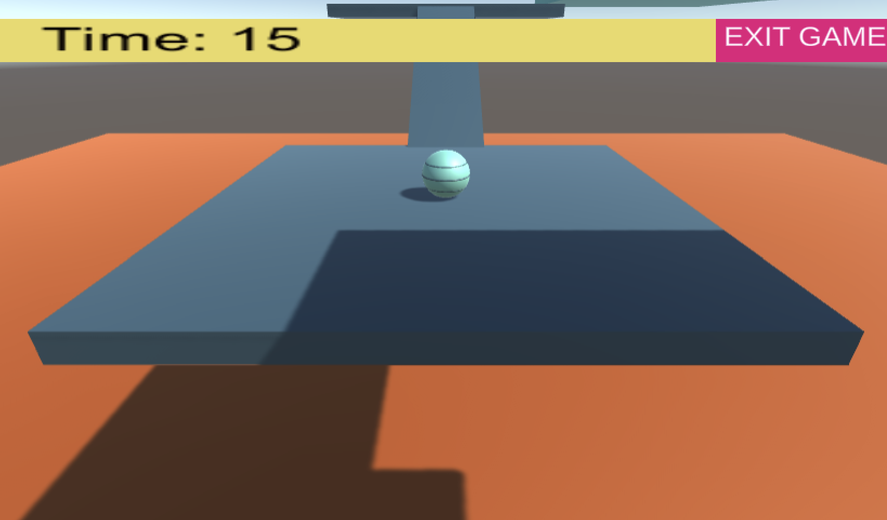
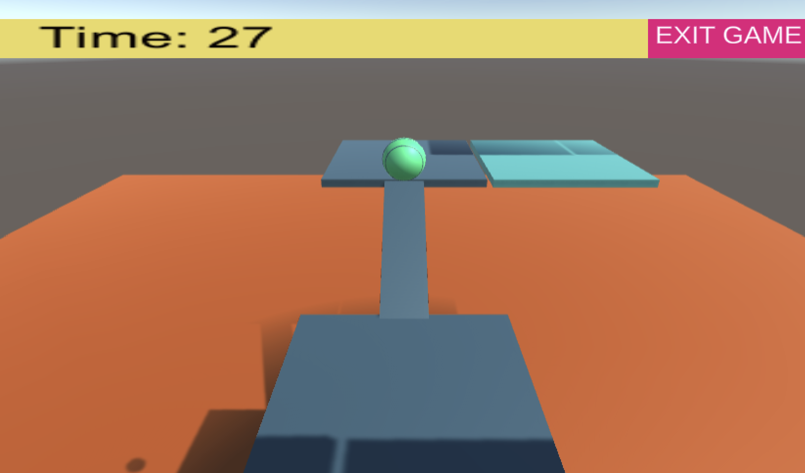
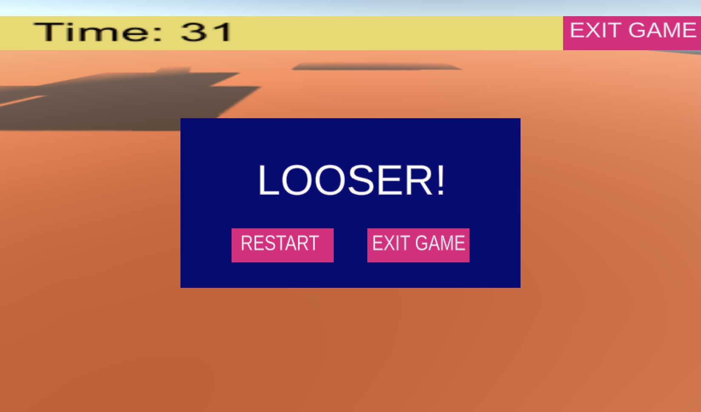

# 3D-augmented-reality

This repository contains some basic examples of 3D augmented reality mainly developed with Unity and Vuforia. 
The examples are based on the course held at the University of Padova.

## Overview 
### 1. Ball Game
In [Ball Game](https://github.com/nicolezattarin/3D-augmented-reality/tree/main/BallGame) we provide an example of simple game that can be implemented in Unity. The goal is to reach the Mars spacecraft with a ball, jumping and moving on the planes. If the ball ends up in the Lava, then a "Game Over" message is displayed and the user can decide either to restart the game or to quit.

An example of interface follows:

  
  

  

We refer to Unity editor 2021.3.2.f1. For sake of completeness the entire project is uploaded for each example, in order to minimize compatibility issues.
